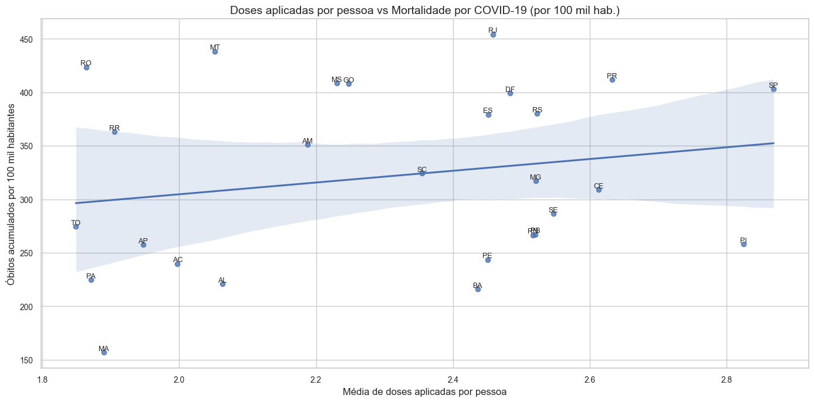

# 📊 Vacinação vs Mortalidade por COVID-19 no Brasil

Este projeto tem como objetivo **analisar se há relação entre o avanço da vacinação e a mortalidade por COVID-19** nos estados brasileiros. A ideia central é investigar se **os estados que mais vacinaram registraram menos mortes**.
- Limpeza e preparação de dados reais
- Análise exploratória por UF
- Visualização com matplotlib e seaborn

---

## 🔧 Tecnologias
- Python 3.10
- Pandas
- Seaborn / Matplotlib
- SciPy
- Jupyter Notebook

## 🧪 Dados utilizados

Foram utilizadas duas bases de dados públicas:

1. **Base de óbitos por COVID-19** por estado (contendo população, óbitos, casos e taxas por 100 mil habitantes);
[Acesse aqui](https://infoms.saude.gov.br/extensions/covid-19_html/covid-19_html.html)
2. **Base de vacinação** com o total de doses aplicadas por estado, incluindo 1ª, 2ª, doses únicas e reforços.
[Acesse aqui](https://infoms.saude.gov.br/extensions/SEIDIGI_DEMAS_Vacina_C19/SEIDIGI_DEMAS_Vacina_C19.html)

Os dados foram tratados, limpos e combinados em notebooks separados.

---

## 📌 Metodologia

O projeto foi dividido em etapas:

1. **Limpeza e padronização** das bases (`notebook_1` e `notebook_2`);
2. **Merge das informações** em um único dataset (`notebook_3`);
3. **Criação de métricas padronizadas**, como:
   - `doses_por_pessoa`: Média de doses por pessoa;
   - `mortalidade_ajustada`: Total de óbitos por 100 mil habitantes.
4. **Visualizações com Seaborn** para facilitar a interpretação dos dados;
5. **Cálculo de correlação estatística** (Pearson e Spearman).

---

## 📈 Visualização

A relação entre vacinação e mortalidade foi representada em um **gráfico de dispersão**, com os estados identificados individualmente:

- Eixo X: `doses_por_pessoa` – Total de doses aplicadas a cada 100 mil habitantes;
- Eixo Y: `mortalidade_ajustada` – Óbitos acumulados a cada 100 mil habitantes.



---

## 📉 Resultados da correlação

Foram avaliadas duas correlações estatísticas:

**Correlação de Pearson** (assume relação linear):
- Coeficiente: `0.2051`
- P-valor: `0.3047` (não estatisticamente significativo)

**Correlação de Spearman** (assume relação monotônica):
- Coeficiente: `0.1984`
- P-valor: `0.3211` (não estatisticamente significativo)

🔍 **Interpretação**:
> Os resultados indicam que **não há uma correlação estatisticamente significativa entre a quantidade total de vacinas aplicadas e a mortalidade acumulada por estado**, considerando a população. A análise sugere que outros fatores também podem estar influenciando as taxas de mortalidade, como infraestrutura de saúde, variantes do vírus, políticas públicas e subnotificação.

---

## 🧑‍💻 Como rodar o projeto

1. Clone o repositório:
   ```bash
   git clone https://github.com/seuusuario/nome-do-repositorio.git
   cd nome-do-repositorio
    ```
2. Instale os pacotes necessários:
   ```bash
   pip install -r requirements.txt
    ```

3. Execute os notebooks em ordem para reproduzir a análise.
